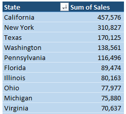
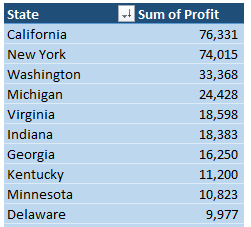
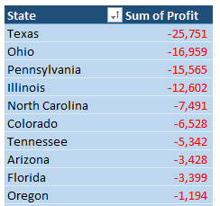
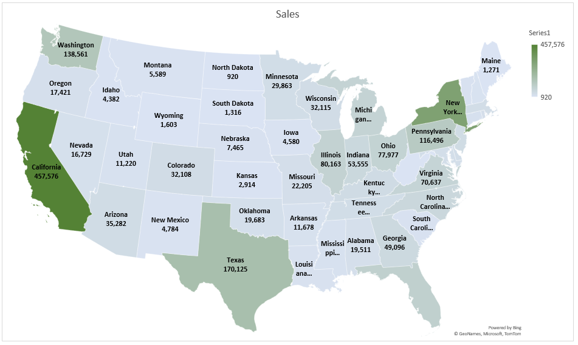
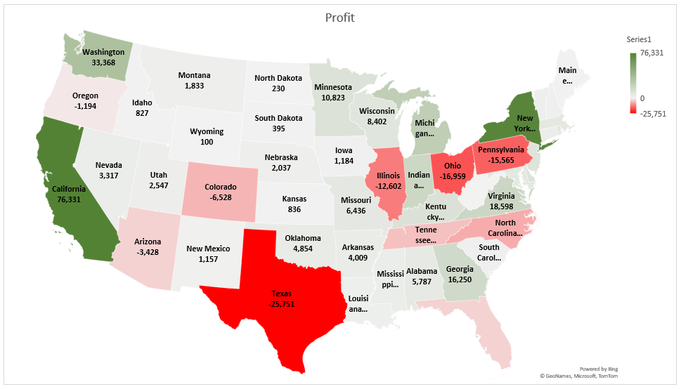
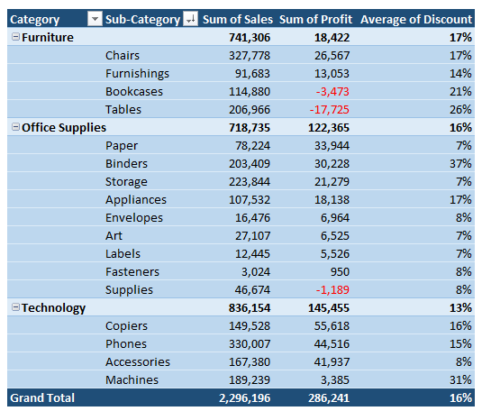

# Excel ile Mağaza Satış Verisi Analizi 

Bu projede ABD'de bulunan küçük bir parekende mağazasının satışlarını inceleyeceğiz.
Amacımız veri setini analiz ederek mağazanın kârını artırmasına ve büyümesine 
yardım edebilecek çıkarımlar yapmaktır.

Veri seti, ABD'nin 49 eyaletinde 500'ün üzerinde şehre yapılan satışların "ship mode, customer segment, 
product category, sub-category, sales, quantity, discount, profit" bilgilerini göstermektedir.

Veri seti: https://www.kaggle.com/datasets/bravehart101/sample-supermarket-dataset

#### Veri Analizi Temel Soruları
- Satış adedi, gelir ve kâr verilerine göre en iyi olan kategori hangisi?
- Gelir ve kâr verilerine göre en iyi olan alt kategoriler hangileri?
- En fazla kullanılan teslimat yöntemi hangisi?
- Gelir ve kâr verilerine göre en iyi eyaletler hangileri?
- Kâr eden ve zarar eden satışların indirim ortalamaları nedir?
- Alt kategorilerin indirim ortalamaları nedir?

## Veriyi Hazırlama
Veri seti zaten temizlenmiş durumda bu yüzden bu aşamada sadece "country" kolonunu siliyorum tüm satışlar 
ABD'de olduğu için. 

---

## Veri Analizi

### Satış adedi, gelir ve kâr verilerine göre en iyi olan kategori hangisi?

Verimiz bize en fazla miktarda satışın belirgin farkla ofis ürünlerinde yapıldığını, 
en fazla gelirin teknoloji ürünlerinden elde edildiğini ve en fazla kârın yine teknoloji 
ürünlerinden elde edildiğini gösteriyor. Ancak burada mobilya ürünlerinden
yüksek gelir elde edilmesine rağmen edilen kârın çok az olduğunu görüyoruz.

Verinin grafikle gösterimi.

---

### Gelir ve kâr verilerine göre en iyi olan alt kategoriler hangileri?

Alt kategorilere göre miktar, gelir ve kâra baktığımızda dikkat çeken nokta 3 alt kategorinin 
zarar etmekte olduğunu görüyoruz. Özellikle masa alt kategorisi çok fazla zarar ediyor.
Bir diğer nokta teknolojinin alt kategorisi copier en az satış yapılan kategori olmasına reğmen
en fazla kâr eden kategori konumunda.

Verinin grafikle gösterimi.

---

### En fazla kullanılan teslimat yöntemi hangisi?

Teslimat yöntemi olarak standart teslimatın 60% oranında, aynı gün teslimatın ise 
5% oranında kullanıldığını görüyoruz. Teslimat fiyatlarını bilmiyoruz ancak 
muhtemelen en ucuz seçenek standart teslimattır. Aynı gün teslimat ise ekstra pahalıdır bu yüzden
çok az tercih edilmektedir.

Verinin grafikte gösterimi.

---

### Gelir ve kâr verilerine göre en iyi eyaletler hangileri?

   

Burada en fazla satış yapılmış, en fazla kâr edilmiş ve en fazla zarar edilmiş 10 eyaleti görüyoruz. 
Dikkat çeken eyalet Texas, iyi bir gelir elde edilmiş olmasına rağmen en fazla zarar edilen eyalet durumunda.
Ayrıca Pennsylvania, Florida, Illinois, Ohio eyaletleri de en fazla gelir elde edilen 10 eyalet arasında olmalarına 
rağmen zarar eden eyaletler arasındalar.

Verilerin harita üzerinde gösterimleri.

---

### Kâr eden ve zarar eden satışların indirim ortalamaları nedir?

Kâr eden ve zarar eden satışları ayrı ayrı gruplayarak bu satışlarda uygulanan indirim oranlarının ortalamalarına baktığımızda, 
net kâr eden satışların indirim ortalamasını " 8% ", net zarar eden satışların indirim ortalamasını " 48% " 
olarak hesaplıyoruz. Bu sonuçlara bakarak uygulanan yüksek indirimlerden dolayı zarar edildiğini söyleyebiliriz.

---

### Alt kategorilerin indirim ortalamaları nedir?

Alt kategorilere göre indirim oranlarının ortalamalarına baktığımızda Bookcases ve Tables kategorilerinin ortalama 20% üzerinde indirimle zarar 
ettiklerini görüyoruz. Ayrıca Binders kategorisi 37% indirim ortalaması ile satılmış olmasına rağmen iyi bir kâr miktarı elde edilmiş.

---

### Öneriler

- Öncelikle zarar ederek satılan ürünlerdeki indirim miktarları kâr edecek şekilde tekrar ayarlanmalı.
- Zarar edilen alt kategori gruplarının indirim oranları azaltılmalı ancak yeni fiyat durumunda bu ürünlerin satışları ciddi miktarda azalırsa bu durumda 
satıştan kaldırılmaları düşünülmeli.
- Düşük müşteri yoğunluğu olan eyaletlere zarar edilmeyecek şekilde ekstra indirimler uygulanabilir. Bu şekilde yeni müşteri kazanılması sağlanabilir.
- Satış adedi ve kâr oranı yüksek alt kategorilerde ürün çeşitliliği artırılabilir.
- Düşük satış adedine sahip ürünler farklı ürünlerle birlikte paket şeklinde satılabilirler.

