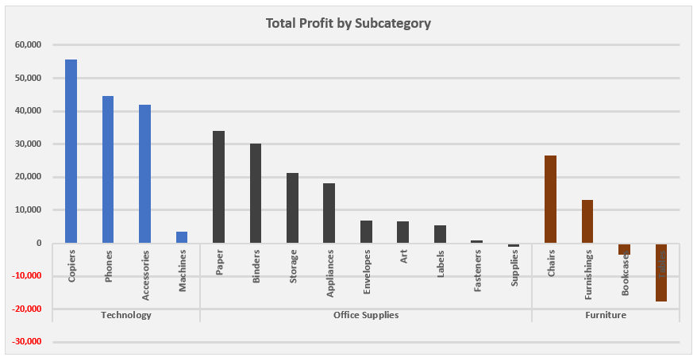

# Excel ile Mağaza Satış Verisi Analizi 

Bu projede ABD'de bulunan küçük bir parekende mağazasının satışlarını inceleyeceğiz.
Amacımız veri setini analiz ederek mağazanın kârını artırmasına ve büyümesine 
yardım edebilecek çıkarımlar yapmaktır.

Veri seti, ABD'nin 49 eyaletinde 500'ün üzerinde şehre yapılan satışların "ship mode, customer segment, 
product category, sub-category, sales, quantity, discount, profit" bilgilerini göstermektedir.

Veri seti: https://www.kaggle.com/datasets/bravehart101/sample-supermarket-dataset

#### Cevap Aradığımız Temel Sorular
- Satış adedi, gelir ve kâr bilgilerine göre en iyi olan kategoriler hangileri?
- Gelir ve kâr bilgilerine göre en iyi olan alt kategoriler hangileri?
- En fazla kullanılan teslimat yöntemi hangisi?
- En kârlı müşteri segmenti hangisi?
- Gelir ve kâr bilgilerine göre en iyi eyaletler hangileri?

## Veriyi Hazırlama
Veri seti zaten temizlenmiş bu yüzden bu aşamada sadece "country" kolonunu siliyorum tüm satışlar 
ABD'de olduğu için. Veride aynı satırlar var ancak silme gereği duymadım çünkü satışları birbirinden 
ayıracak satış_id gibi bir kolon yok yani benzer satın alımlar yapılmış olabilir.

---

#### Satış adedi, gelir ve kâr bilgilerine göre en iyi olan kategoriler hangileri?

Verimiz bize en fazla miktarda satışın belirgin farkla ofis ürünlerinde yapıldığını, 
en fazla gelirin teknoloji ürünlerinden elde edildiğini ve en fazla kârın yine teknoloji 
ürünlerinden elde edildiğini gösteriyor. Ancak burada mobilya ürünlerinden
yüksek gelir elde edilmesine rağmen edilen kârın çok az olduğunu görüyoruz.

Verinin grafikle gösterimi.

---

#### Gelir ve kâr bilgilerine göre en iyi olan alt kategoriler hangileri?

Alt kategorilere göre miktar, gelir ve kâra baktığımızda dikkat çeken nokta 3 alt kategorinin 
zarar etmekte olduğunu görüyoruz. Özellikle masa alt kategorisi çok fazla zarar ediyor.
Bir diğer nokta teknolojinin alt kategorisi copier en az satış yapılan kategori olmasına reğmen
en fazla kâr eden kategori konumunda.

Verinin grafikle gösterimi.

